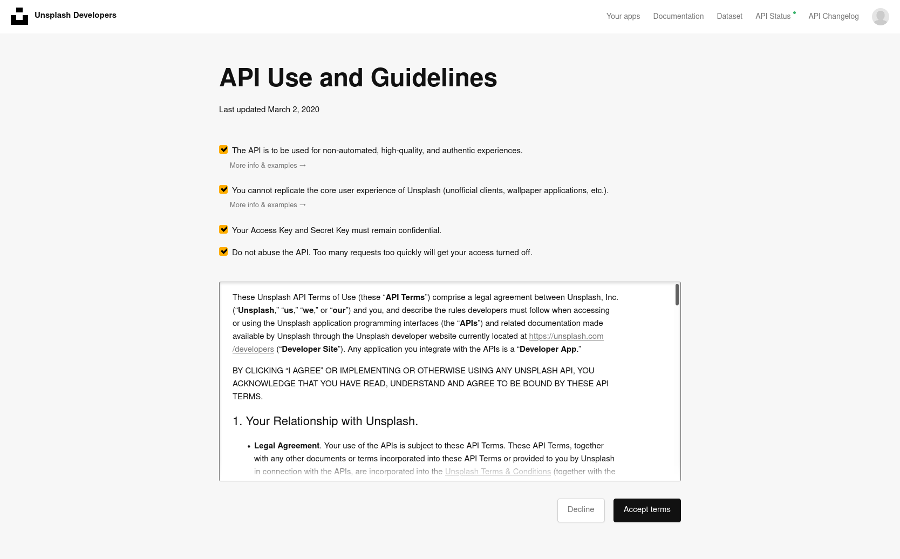
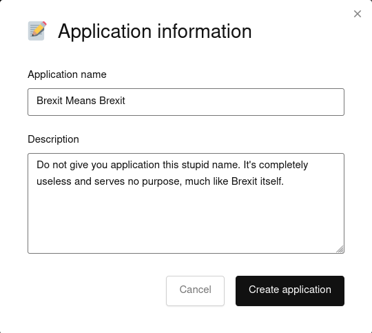
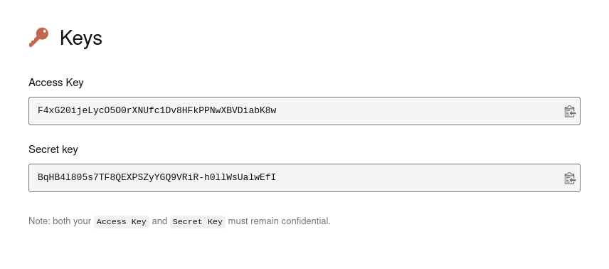

## Create Unsplash developer account

The lovely folks at Unsplash want developers to sign up to their API so they can do things like rate limiting and abuse detection. Understandable.

1. Go to [unsplash.com/join and sign up](https://unsplash.com/join). If you want to test out the API and don't fancy giving Unsplash your real email, use something like [temp-mail.org](https://temp-mail.org/en/) to create a throw-away email account.

## Make an application

To help keep things organized, Unsplash lets you create separate applications within their developer console. Each application has its own set of keys. Let's create a new application and get the keys.

1. Once you've created an account and logged in, go to [unsplash.com/oauth/applications](https://unsplash.com/oauth/applications).
1. From the developer homepage, click **New Application**.
1. Check all the _"I promise I won't break or abuse stuff"_ boxes, then click **Accept terms**:

    

1. Give your application a super useful name and description:

    

1. Click **Create application**.
1. You should now be looking at a homepage for your application. Scroll down until you find the **Keys** section:

    

    Make a note of the **Access Key**; we'll be using it later. In fact, why not just keep this tab open until we're finished.

## Start scripting

Now that we've got out access keys set up, we can actually start creating the script! I decided I want to set my background to a random Unsplash image with the `nature` tag attached to it:

```bash
#!/bin/sh
# Download a random photo from Unsplash using the 'Nature' tag and set it as the desktop background.

wget -O /tmp/Wallpaper.jpg $(curl -s 'https://api.unsplash.com/photos/random?query=nature&count=1&client_id=F4xG20ijeLycO5O0rXNUfc1Dv8HFkPPNwXBVDiabK8w' | jq -r '.[0].urls.regular')
gsettings set org.gnome.desktop.background picture-uri file:////tmp/wallpaper.jpg
```

Let's go through it line by line.

1. `#!/bin/sh`

    This thing is called a [shebang](https://en.wikipedia.org/wiki/Shebang_%28Unix%29), and it tells the shell what program to interpret the script with.

1. `# Download a random photo from Unsplash using the 'Nature' tag and set it as the desktop background.`

    This is a comment explaining what the script does. I _highly_ recommend you add one yourself. They're super handy when you find the script again months down the line and forget what it does.

1. `wget -O /tmp/Wallpaper.jpg $(curl -s 'https://api.unsplash.com/photos/random?query=nature&count=1&client_id=F4xG20ijeLycO5O0rXNUfc1Dv8HFkPPNwXBVDiabK8w' | jq -r '.[0].urls.regular')`

    Now we're into the real meat of the script. I'll chop this up into sections:

    | Thing | Description |
    | ----- | ----------- |
    | `wget -O /tmp/Wallpaper.jpg` | Download _something_ from the internet and save it as `Wallpaper.jpg` in the `/tmp/` directory. More about this in the [notes](#notes). |
    | `$(` | Run everything between the parentheses `()` out output the result right here.  |
    | `curl -s` | Curl is a program that grabs data from the internet. It's like visiting a website in a browser, except the data is sent to your terminal instead of a browser window. The `-s` tag signifies that we want this process to be _silent_. Without the `-s` tag, we'd get loads of loading information and status stuff that we don't really care about. |
    | `https://api.unsplash.com/photos/random` | This is the _base-url_ that we're using to get our picture from. The `photos/random` bit is a built-in function of the API, and it returns a bunch of random photos to us. If you open this link in a browser, you'll see a bunch of JSON data. We're going to use `jq` to _decode_ this JSON data. |
    | `?` | Tell the Unsplash API _everything following this character is a key-value pair_. Key-value pairs look like `key=value`. So `colour=red` would mean I'm looking for a variable called `colour`, and I want to set that variable to `red`. |
    | `query=nature` | Tell the Unsplash API that I only want photos that have the `nature` tag assigned to them. You can change this to [any tag available in Unplash](https://unsplash.com/t). |
    | `&` | Tell the Unsplash API that the last variable just ended, and a new one is about to begin. |
    | `count=1` | Only return one photo. |
    | `&` | Again, tell the Unsplash API that we've got a new variable incoming. |
    | `client_id=F4xG2...` | The `client_id` is how Unsplash knows who is doing what. Unsplash will not let you do anything with their API _without_ supplying a valid client ID.

1. `gsettings set org.gnome.desktop.background picture-uri file:////tmp/wallpaper.jpg`

    Gnome is the desktop manager application. This command tells it to set the `background` variable as whatever content is in `/tmp/wallpaper.jpg`.

So that's the whole script. Now that we know what's going on, we need to save it somewhere. Copy and paste this whole codeblock into a command-line to create a script called `random-unsplash-wallpaper.sh` in `~/Scripts/`:

```bash
cat <<EOT >> ~/Scripts/random-unsplash-wallpaper.sh
#!/bin/sh
# Download a random photo from Unsplash using the 'Nature' tag, and set it as the desktop background.
wget -O /tmp/Wallpaper.jpg $(curl -s 'https://api.unsplash.com/photos/random?query=nature&count=1&client_id=JiguFle4kZ4TeQpfLwwC19gXF6E0aCSWZTomnBq1Umg' | jq -r '.[0].urls.regular')
gsettings set org.gnome.desktop.background picture-uri file:////tmp/wallpaper.jpg
EOT
```

To test that we've got everything set up properly, run the script:

```bash
bash ~/Scripts/random-unsplash-wallpaper.sh
```

Your background _should_ changed. Keep in mind that you need to be connected to the internet for this script to run.

## Set the background automatically

So we've got the script, and we've checked that it works. All that's left to do is automatically run the script every time we log into the computer. We're going to use a program called Cron. Cron is a time-based job scheduler that runs on pretty much every Unix OS. In very basic terms, Cron runs scripts or commands exactly when you tell it to.

1. Enter Cron's _edit_ mode:

    ```bash
    sudo crontab -e
    ```

    When you first enter the Cron editor, it'll ask you what text editor you want to use. I use Vim because I hate myself, but you can use whatever editor you prefer.

1. Scroll to the bottom of the editor and enter this line, replacing `johnny` with your username:

    ```bash
    @reboot /home/johnny/Scripts/random-unsplash-background.sh
    ```

1. Save your editor. If you're in Vim, hit `ESC`, then enter `:wq`.

Everything should now be set up properly! Every time you log in, you should see a shiny new background from Unsplash. Keep in mind that the script has no way of knowing which images you've already seen, so there is a tiny chance that you'll see the same picture more than once. We _could_ add some way to record which images we've already seen, but I'm not really in the mood for dealing with save files right now. 

## Notes

### The `Wallpaper.jpg` location

I put the `Wallpaper.jpg` file in `/tmp` because it's a directory that exists on pretty much every Unix OS, **and** it's temporary. Since I'm gonna be overwriting `Wallpaper.jpg` on every boot, it makes sense to put this file in a temporary location.
