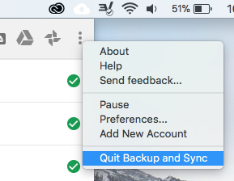
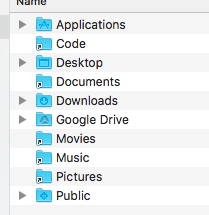

There's a way to do this in OSX to, but it's a bit less user-friendly and requires delving into the terminal. We're only going to cover the Documents folder in this tutorial, but the process can be repeated for any other folder on your machine.

## Deletion Warning

During the process, we're going to **delete everything** that's inside your Mac's **Documents folder** (we're not deleting anything inside your Google Drive). So just to be safe we'll be creating a copy onto your Desktop. If you decide you don't need the copy after all, then feel free to delete it.

## Steps

1. Download and install [Google Drive](https://www.google.com/drive/). After all your files and folders have finished syncing, quit the Google Drive application. Don't just close it, but completely quit out of it so that it's no longer running on your machine.

    

2. Next we need to delete your current Documents folder. Keep in mind that anything inside this folder is about to be **deleted permanently**, so take a backup as anything deleted by using the `rm` command skips the Trash bin and gets deleted immediately. Open the terminal and run the following (enter your password if asked):

    ```shell
    cp ~/Documents ~/Desktop/
    sudo rm -rf ~/Documents
    ```

3. Run the following to create the new link:

    ```shell
    ln -s ~/Google\ Drive/Documents/ ~/
    ```

4. That's it! Your Documents folder will now look like a link in Finder, but it will still function as a folder for all your applications and things.

    

## Multiple Folders

If you want to, you can repeat this process for any of your other folders, like your Videos or Pictures.



For example:

```shell
sudo rm -rf Music
ln -s ~/Google\ Drive/Music/ ~/

sudo rm -rf Pictures
ln -s ~/Google\ Drive/Pictures/ ~/

sudo rm -rf Code
ln -s ~/Google\ Drive/Code/ ~/

ln -s /Volumes/Micro\ SD/media/2017-11-16-symlink-google-drive-on-osx/ ~/
sudo rm -rf Movies
```

In the last example (Movies) I created a link to a Micro SD card that is permanently in my Macbook.

