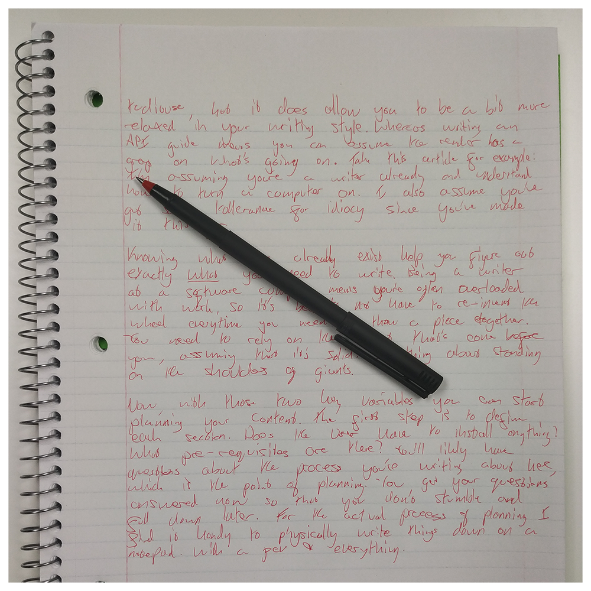
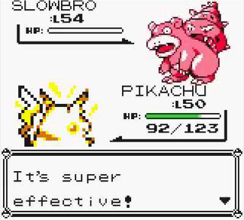
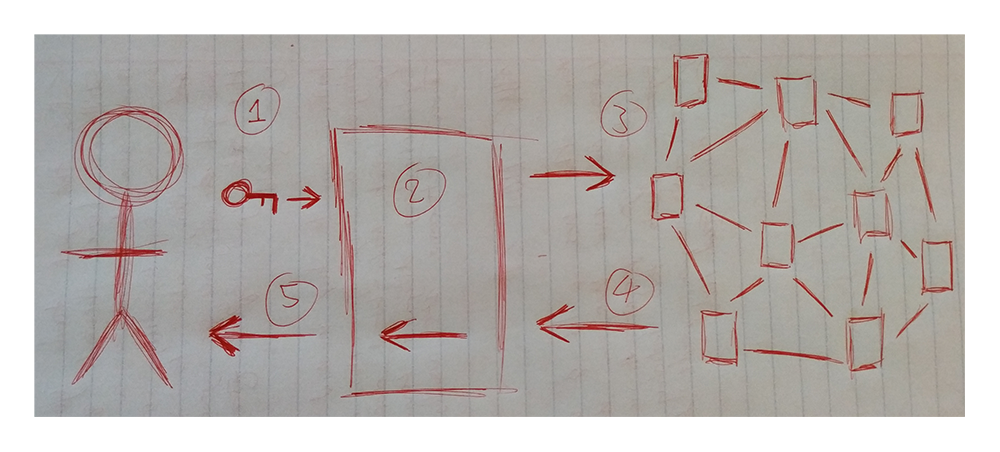
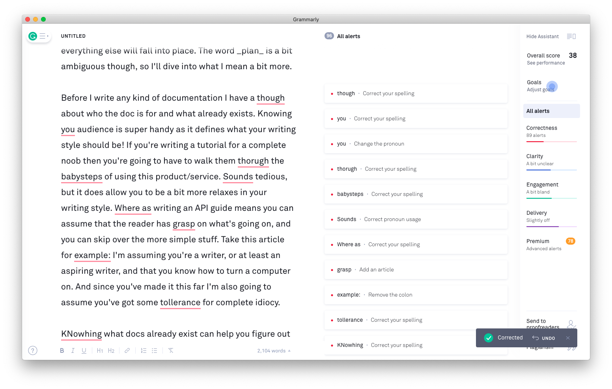

There are only about 5 things that you need to do to become a documentation-god and finally have the approval of your shockingly distant parents:

1. Plan
2. Write
3. Draw
4. Fix
5. Test

You can remember these steps by using the handy mnemonic `<INSERT HANDY MNEMONIC HERE>`.

## Plan

This is either going to seem obvious or unnecessary, depending on the kind of person you are. But this is _the_ most important step within this article. With a solid plan, everything else will fall into place. The word _plan_ is a bit ambiguous though, so I'll dive into what I mean a bit more.

Before I write any kind of documentation I think about who the doc is for and what already exists. Knowing your audience is super handy as it defines what your writing style should be! If you're writing a tutorial for a complete noob then you're going to have to walk them through the baby steps of using this product/service. It sounds tedious, but it does allow you to be a bit more relaxes in your writing style. Whereas writing an API guide means you can assume that the reader has a grasp on what's going on, and you can skip over the more simple stuff. I'm assuming you're a writer, or at least an aspiring writer, and that you know how to turn a computer on. And since you've made it this far I'm also going to assume you've got some tolerance for complete idiocy.

Knowing what docs already exist can help you figure out exactly what you need to write. Being a writer in the tech industry means you're often overloaded with work. There's a shortage of good programmers, and there's an even bigger shortage of good writers and people who can explain things. With this in mind, it's best to not re-invent the wheel for every article you put together. You need to rely on the content that's already been created. Link to previous posts or guides. Sure you need to give your reader everything they need to finish the task, but it doesn't mean you have to write all that material now! Something about standing on the shoulders of giants.

With those two key variables, audience and existing docs, you can start planning your content. The first step is to define each section. Does the user have to install anything? What are the pre-requisites here? You'll likely have questions about the process you're writing about here, which is the whole point of planning. You get to have your questions answered now so that you don't stumble and fall later on in the writing process. For the actual process of planning, I find that it's handy to physically write things down on a notepad, with a pen and paper and everything. It keeps things simple, and it's slow enough to let me think. It also comes with the added benefit that it gets me away from the millions of distractions on my computer, something we'll delve into a bit later.

Once you've finalized your plan you can run through it and make sure yo[ure not missing any major points. If you're writing something like an end-to-end tutorial this is the perfect time to run through the steps to make sure nothing is missing. If you're putting a more conceptual piece together, like a deep-dive into a complicated process, walk things through with a colleague or an expert on this topic. Writers can't be experts on everything, so we need to lean on those who know more than us to make sure everything _works_.

## Write

This is the most obvious step, but how you write is important. There's been a bunch of studies recently that say it takes _bloody ages_ to get back into the groove of working after being distracted. And yes, _bloody ages_ is a scientifically correct term used in academic circles. Anything you can do to minimize your distractions will massively improve your writing. For a lot of people, their mood affects their writing style, and the thread of an impending deadline is no bigger killer to a consistent style. Rushed writers create rushed work. Remove yourself from distractions, write your piece, and get the work done!

How you remove yourself from distractions depends on what you're working on, and also the kind of worker you are. If you're writing an installation guide or programming tutorial then you're probably gonna need to use your computer. I find the computer to be terrible for my creative process, but needs must. If I have to write on a computer then step one is to turn off Slack. Not just minimize it, but completely close out of the program. Second, I put my phone on do-not-disturb mode and put it face down. Lastly, if the task allows, I'll turn my WiFi off. Pretty much all the fun things I want to do with my computer require an internet connection, so severing this line is like using Firestorm against Bulbasaur - super effective.

Now I'm going to assume that work with other people, and that those people probably want to contact you at some point. The trick is to let them know you're going to be out of action for a little bit. It can be an hour, twenty minutes, or the whole day! It completely depends on what you've got going on, how urgent the piece is, and what you're feeling like. For example, for this article, I worked from home for a day, wrote everything on a notepad in the morning, and copied everything over to my laptop in the afternoon. I checked in with everyone on my team at around 1 pm, just to make sure there were no fires that needed putting out. If you did the planning phase correctly then you shouldn't need to contact any of your colleagues for this article that you're working on

I've talked a lot about distractions and how to isolate yourself from them, but not much about actually making words into sentences. If you ask most managers and higher-ups what their staff's most precious resource is, they'll say time. They're wrong. Everyone's most precious asset is energy. It takes energy to stay focused. If you're constantly being distracted and disturbed, then you're spending your energy on dealing with outside issues and not getting your work done. Once you eliminate all the muddiness that comes from an external source you can put all your energy into expanding upon what you defined in your plan.

For a lot of articles, you won't be able to complete the whole thing in one go. But if you're able to stay focused for an hour at a time then you'll end up with a solid piece that consistent and flows logically.

## Draw

This is going to be a point of contention for some of the writing purist out there, especially those that believe if you're a good enough writer you don't need to draw. And while that _might_ be true for certain academic circles, it's absolute bull for the general population. According to the very hasty search I just did, about 65% of people are visual learners. Keep in mind I have no source to back this information up with, so I could be lying. But if I'm correct it means at least half of your readers need some kind of visual explanation to understand the concept you're trying to describe. Myself included! Pretty much every presentation I've ever given has consisted of pictures, gifs, and Brexit jokes.

But what if you don't have a major in fine art from `<INSERT PRESTEGIOUS ART COLLEGE HERE>`? Again, stand on the shoulders of giants. Say you're writing a guide on how to deploy a web application to a blockchain, there are three separate concepts you're going to have to explain:

- What a blockchain is.
- What the web application does.
- How the deployment process works.

Hopefully, you'll have a decent grasp on this process already, following your planning stage. So the next step is to visually represent these three things. Start simple, map out each process on a piece of paper. Once you've got your design down, simplify it.

Once you've got things down to their basic level take it into a drawing tool like Paint.net of Draw.io. You'll find that once everything is digital it makes things easier to simplify again! If you're worried about things looking nice of fitting to brand guidelines pass your diagrams and illustrations off to your company's graphics department. Don't have one? Try and get the budget to hire a freelancer. Failing that, teach yourself! Sites like YouTube and Skillshare have thousands of Photoshop and Illustrator tutorials. Being able to articulate a complex topic without using words is an incredibly unique skill to have. Being able to say you created all the beautify diagrams for your company's docs is something that can set you apart from all the other writers in your field!

## Fix

So you've got your article and all your images. Now it times to fix everything that's broken. There's always something that's broken, nobody writes perfectly first time round. There's going to be spelling mistakes, grammatical issues, broken images, and a weird flow. The best thing to do is to accept that they're there and fix as many as you can automatically. Tools like Grammarly and Hemmingway are excellent for this kind of thing.

If you have access to some kind of automatic build-tools you can take advantage of helpers like `spell-check-js` and `NSpell`. They can automatically flag and fix spelling and grammar issues for you. Saves you copying and pasting in and out of Grammarly.

It's also a good idea to preview your docs in the format that your users will be using them. This gives you a chance to see if the images are correctly formatted, if the paragraphs flow, and to split things up if you're faced with a wall of text.

## Test

Writing does is not dissimilar to writing code, in that they both need to be tested to make sure they work. One slight disadvantage that writers have is that it's incredibly tricky to automate those tests. We've touched on some automation tools that help fix some of the glaring issues in your docs, but there isn't anything to help you with things like pacing, structure, and tone right now. Another difference between docs and code is that docs are, 99% of the time, read by people. This means that to properly test your articles, you're going to need to run it by some actual people.

This is where writers need to flex their diplomatic skills a little bit since most of your colleagues and friends probably won't be too enthusiastic about running through your guides. There's no hard and fast rule for managing this, however. If you're on a team with other writers then it's fairly simple to have them review your stuff. But if you're not graced with a fully stacked team of writers, you're going to have to enlist the help of other colleagues within your company. Bribes help.

For those developer open-source tech, there's a whole group of people you can lean on - the community! If your company has a solid developer-relations department then engage with them and see if they can post your articles to be peer-reviewed by the community. Fair warning: real-world users of your docs are the most honest and harshest critics you will face. The anonymity of being behind a keyboard allows for some no-holds-barred criticisms of your work. This is a good thing. The majority of it will be a completely valid and excellent use of your time. Just make sure you've got a thick hide before asking for comments from end-users.

## That's about it

Hopefully, you made it to here, and now have a more solid idea of how to please your parents. As with everything else in the tech industry, writing docs is an evolving process and everyone needs to find a workflow that works for them. I hoping that the steps provided here have given you at least a good foundation to build off.
