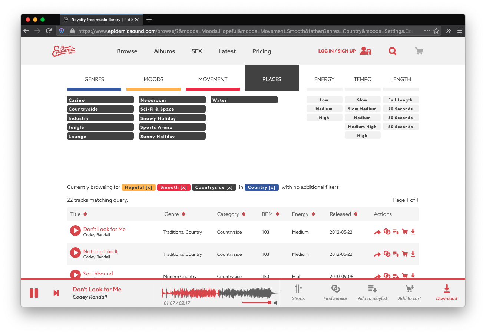

The Search for Maree Docia series is without a doubt my most popular post. Maybe it's because this story is enthralling and everyone really wants to know who she is! Or maybe it's because all my other posts are about very niche programming-related topics. Either way, a commenter by the name of [`t_w_t`](https://medium.com/@t_w_t/looks-like-the-music-is-copyrighted-by-epidemic-sound-5ddd09524137) revitalized the search:

> Looks like the music is copyrighted by Epidemic Sound.

Time to jump back down the rabbit hole.

My first port of call was to email the company [Epidemic Sound](https://www.epidemicsound.com/) to see if they could give me any information. From the looks of things, they're a content distribution company based out of Stockholm. I think they act as an intermediary between content creators (musicians in this case) and people who want to use their music. You can search for music based on its genre, mood, and movement, along with a bunch of other filters.

If you're wondering, Maree Docia's _At Last, Sunrise_ fits into the following categories:

| Genre | Category | BPM | Energy |
| ----- | -------- | --- | ------ |
| Beautiful | Relaxing | 69 | Low |

There's not much to go off here, so I browsed around and managed to find an email address. I sent Epidemic Sounds to see if I could get some basic information, mainly who Maree is, what contact they've had with her, and where she came from. Somewhat predictably, however, they weren't able to give me any information about Maree. It's not that they don't know anything, but that they're legally not allowed to give it out. That's what they're claiming anyway. Unfortunate, but understandable.
