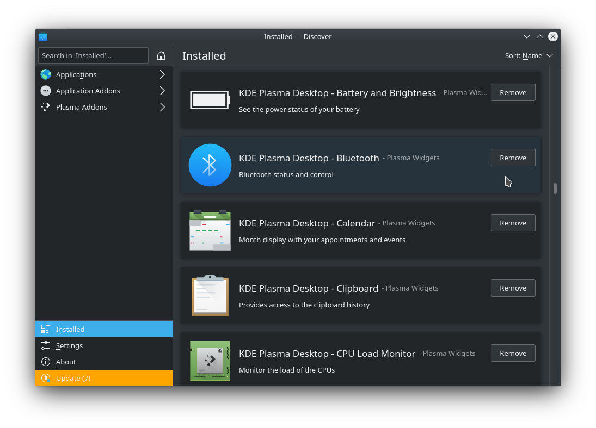

The clipboard app just keeps a record of everything that's been in your clipboard. A fairly useful utility, unless you copy your passwords to clipboard using a password manager. So, to mitigate security issues I decided to get rid of the clipboard app. I used Kubuntu's built in software center _Discover_, clicked **Installed** and scrolled down until I found **KDE Plasma Desktop - Clipboard**. Then I clicked **Remove** and carried on with my day.



A while later I needed to reboot my machine, so I did. But when it came time to login, I was greeted with a completely different screen to my usual login experience. For one thing, an onscreen keyboard took up the entirity of the screen, and it was set to _British English_ for some reason. I am English, but I live in Canada, so not sure how KDE figured that one out.

After closing down the huge on-screen keyboard I tried to login with my password. Annoyingly the login screen wouldn't do anything when I pressed `enter`. I even tried bringing up the on-screen keyboard and logging in that way, but still, the desktop environment refused to let me press `enter`.

So, I opened the terminal (`ctrl` + `alt` + `f2` if you wanted to know) and had a look around. After some digging, it turns out the clipboard app I uninstalled earlier is somehow tied to the Plasma desktop environment and without it, entry past the login screen was blocked.

I was hoping to simply re-install the clipboard app, but it turns out you can't. What you _can_ do, however, is reinstall the Plasma software. First I connected to the wifi:

    ```shell
    sudo iwconfig wlo1 essid WIFI_NAME key s:WIFI_PASSWORD
    ```

Then I removed `plasma-desktop-data` installed `plasma-desktop`:

	```shell
	sudo apt remove plasma-desktop-data -y
	sudo apt install plasma-desktop
	```

After that I did a quick reboot I found that it fixed most things. The on-screen keyboard popped up, but I was able to minimize it and login. Once I was in, everything looked the same. Tool bars were in the same place, touchpad settings still worked, all that stuff.

Nice!

