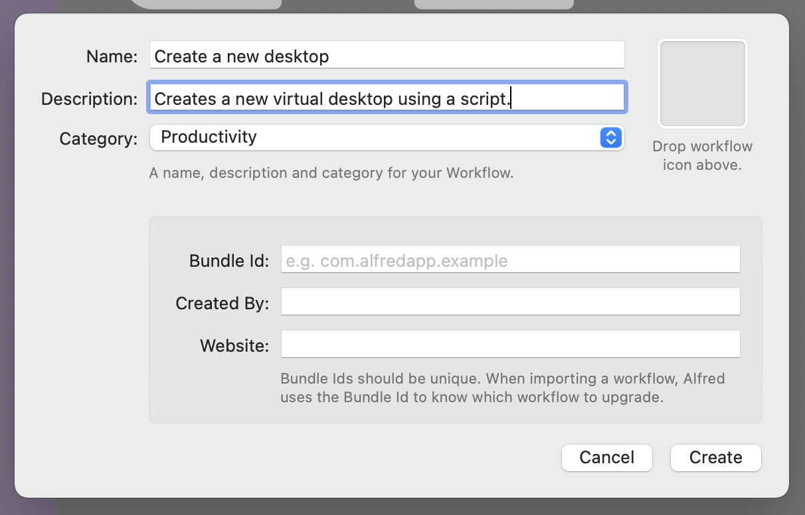
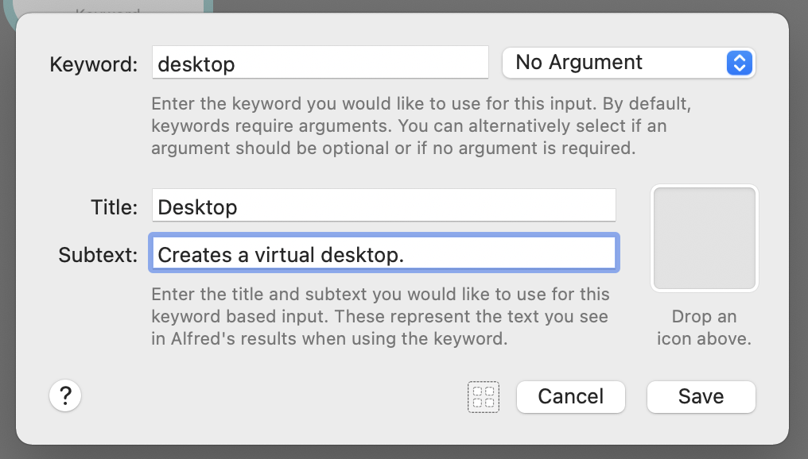
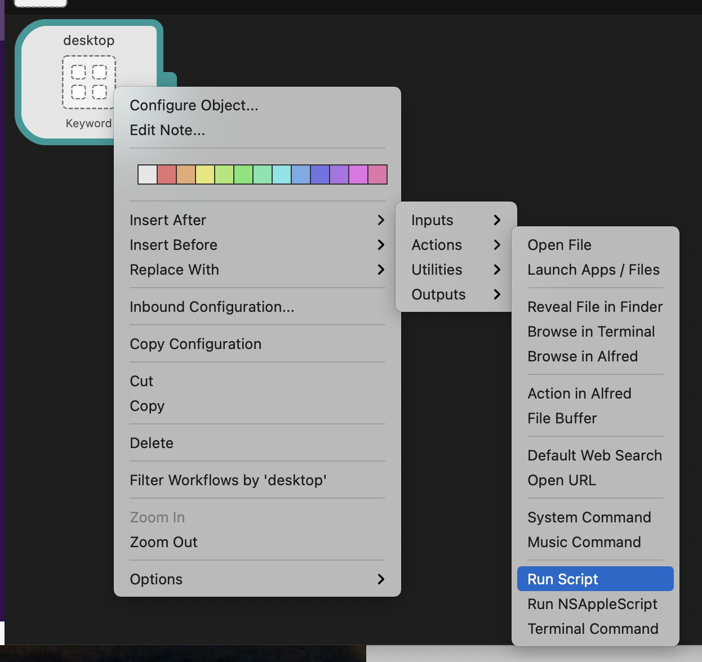
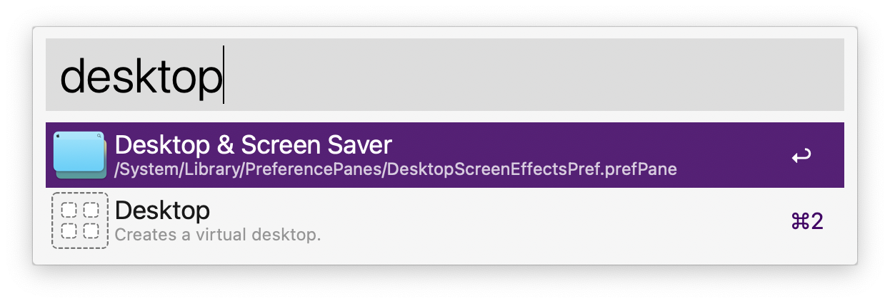

Virtual desktops good! Default MacOS behavour bad.

1. Install Alfred.
1. Buy the pro version.
1. Select **Workflows** and create a blank workflow.
1. Enter the following info:

    | Field | Value |
    | --- | --- |
    | Name | Create a new desktop. |
    | Description | Creates a new virtual desktop using a script. |
    | Category | Productivity |

    

1. Click **Create**.
1. Right-click in the workflow panel and select **Input** > **Keyword**.

    

1. Enter the following information:

    | Field | Value |
    | --- | --- |
    | Keyword | desktop |
    | Arguments dropdown | No arguments |
    | Title | Desktop |
    | Subtitle | Creates a virtual desktop. |

    

1. Right click the block that was just created and select **Insert after** > **Actions** > **Run script**. 

    

1. Set the **Language** to **osascript (AS)**.
1. Leave **with input as argv** and running instance **sequentially** as their defaults.
1. Paste the following code into the textbox:

    ```applescript
    #!/usr/bin/osascript
    tell application "System Events"
      do shell script "/System/Applications/Mission\\ Control.app/Contents/MacOS/Mission\\ Control"
      click button 1 of group "Spaces Bar" of group 1 of group "Mission Control" of process "Dock"
      do shell script "/System/Applications/Mission\\ Control.app/Contents/MacOS/Mission\\ Control"
    end tell
    ```

1. Click **Save**.
1. Open Alfred and search for `desktop`.

    

1. That's it!

Now, every time you search for `desktop` in Alfred, MacOS should create a new desktop for you! You could also follow the steps above to create a script to _delete_ an open desktop if you were so inclined.

