# Install LOTRO on an M1 Mac

Installing Lord of the Rings Online (LOTRO) on a M1 Mac is shockingly easy. It's pretty much a two step process, well mostly. I'm running a 2020 Macbook Air with 8GB RAM. My battery was fully charged before I started this installation, and by the time I was able to play the game, it had dropped down to 90%. This CPU is insane.

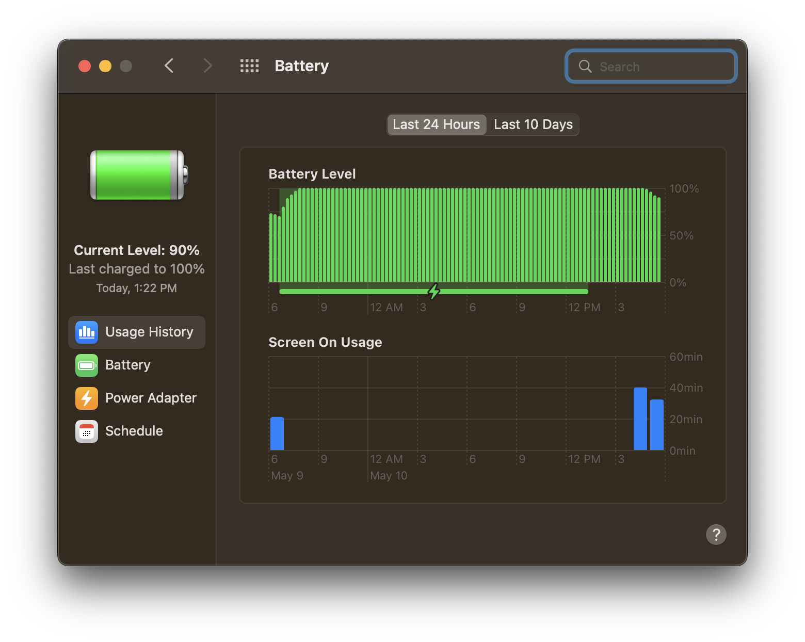

## Get Crossover by Codeweavers

1. Go to [codeweavers.com](https://www.codeweavers.com/)

    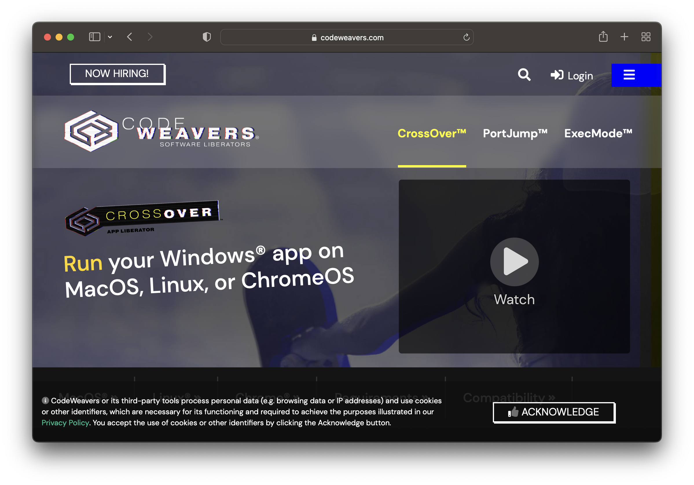

1. Select **CrossOver** -> **MacOS**.
1. Click **FREE TRAIL**.
1. Enter your name and email.
1. The download should start automatically.
1. Extract the `.zip` file.
1. Move the `CrossOver.app` file into your **Applications** folder.
1. Open `CrossOver.app`. You might get a warning about opening a `.App` file from an untrusted source. Click **Open** anyway.
1. Click **Try Now** on the trail windows that pops up.

    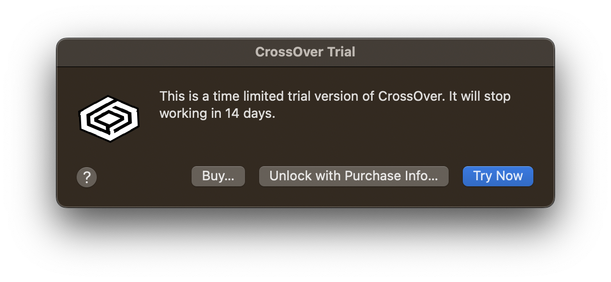

## Install LOTRO and it's dependencies 

1. Once the CrossOver app is open, click **Install a Windows Application**.
1. In the CrossOver Software Installer window that pops up, click **Browser All Applications**
1. Use the searchbar to find _Lord of the Rings Online_. Select the game from the list and click **Continue**.

    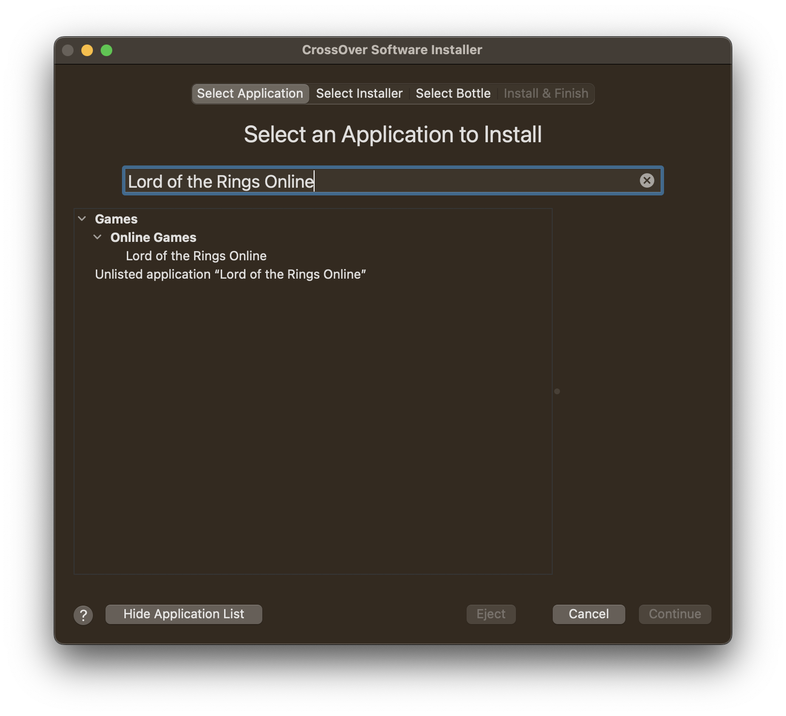

1. Click **Install**.
1. CrossOver will start downloading the game and it's dependencies.

    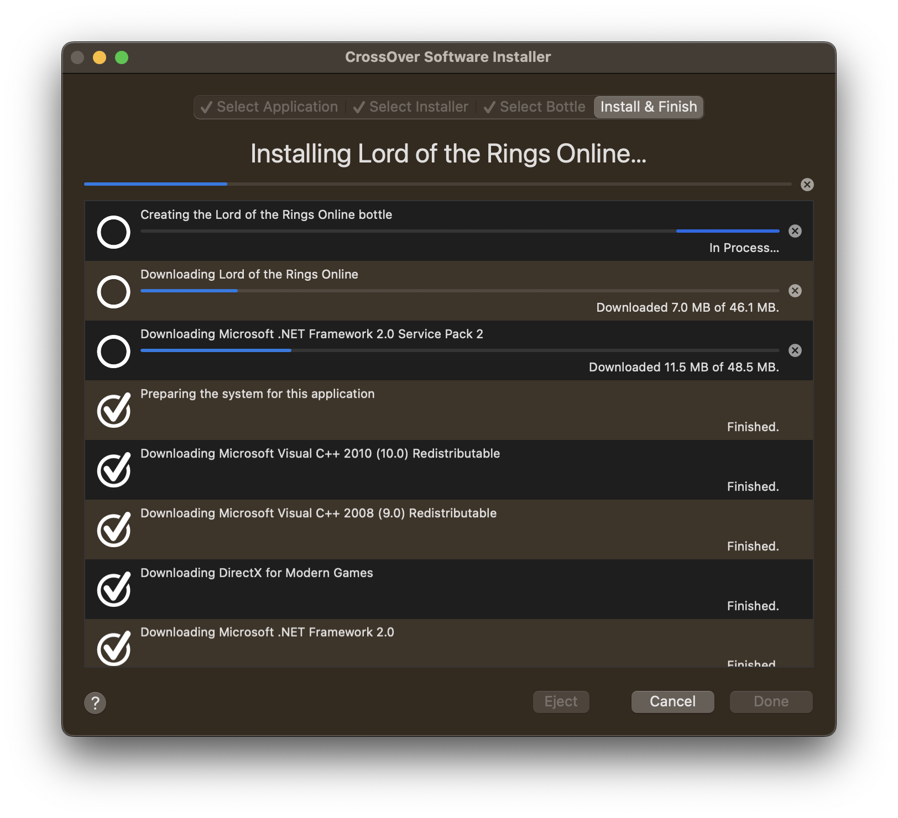

1. Various frameworks will pop up requesting to be installed. Follow through the install windows, keep the options set to their defaults. There's quite a few, so be patient.

    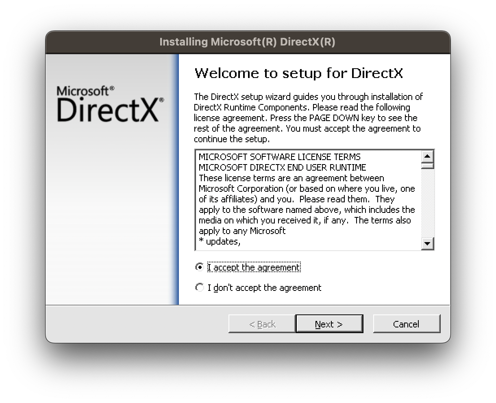

1. At some point you'll be asked to restart your computer. Click **Restart later**; there's still more dependencies to install.

    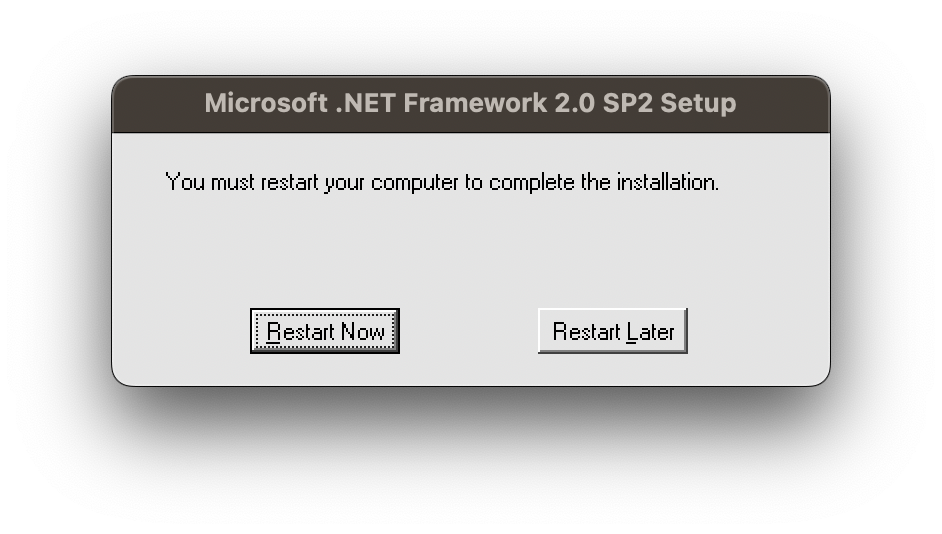

    It took me about 10 minutes to install all the dependencies.
1. Eventually you'll get to the LOTRO setup.

    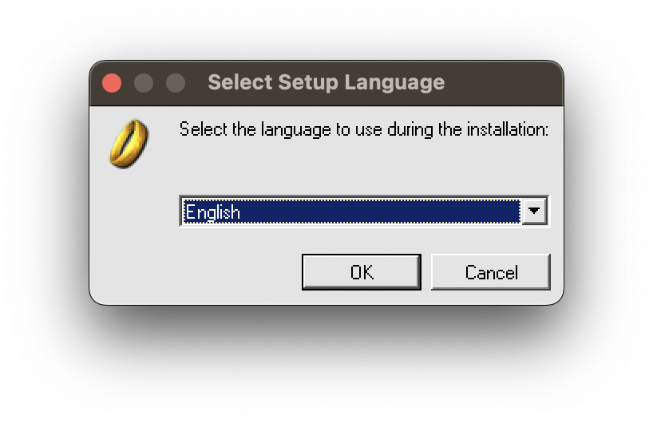

1. Click **Install**.
1. Select **Express** and follow through the prompts.
1. Once you're finished, make the checkbox to start LOTRO once the installer closes and click **Finish**.
1. When LOTRO open, click **Yes** when asked if you want to download the HD textures.

    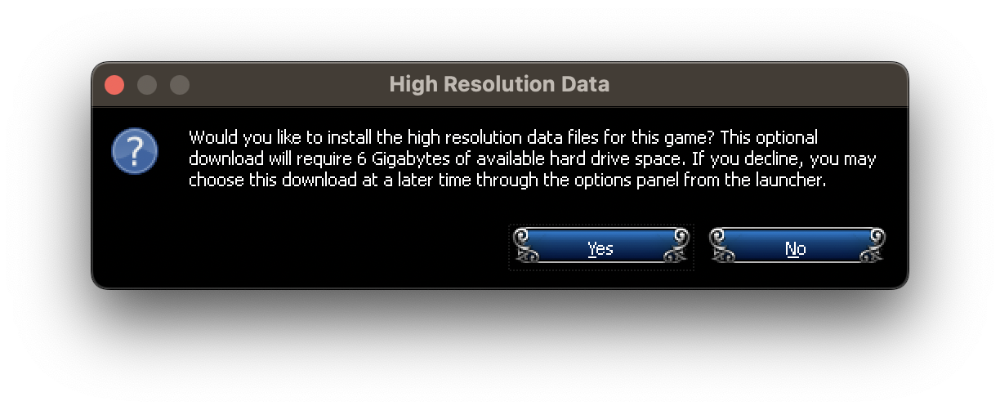

1. LOTRO will start downloading. This bit is gonna take a while.

    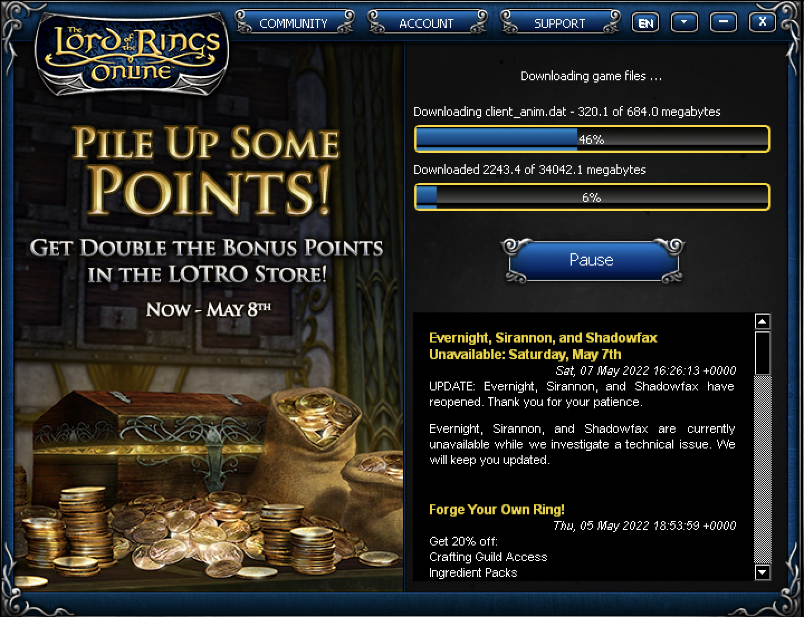

    Eventually the game will start!

1. Log in and start the game.
1. When prompted whether or not to run DirectX 11, click **Yes**.

    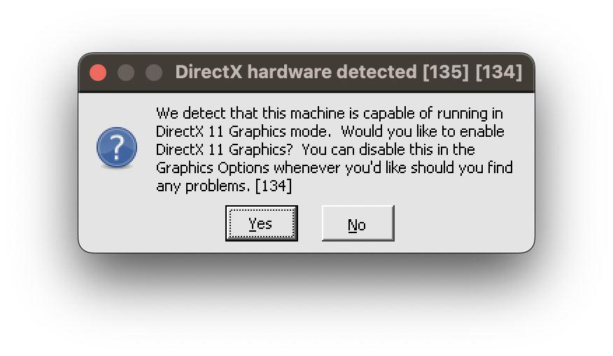

1. Allow CrossOver access to your Documents folder.

    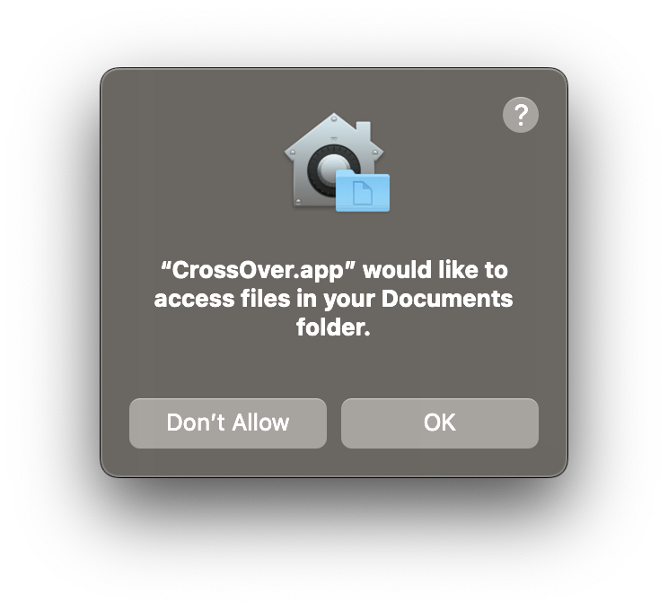

1. Allow CrossOver access to your microphone.

    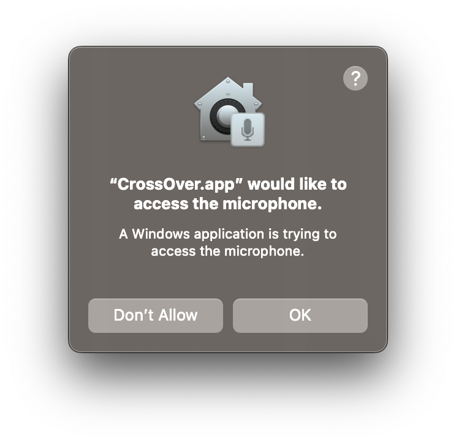

## Tweaking the settings

When LOTRO started for me, it had all the setting maxed out. I turned things down to **High** and that seemed to work best. I haven't noticed any major difference between running the game on battery, and plugging the laptop into the charger.
