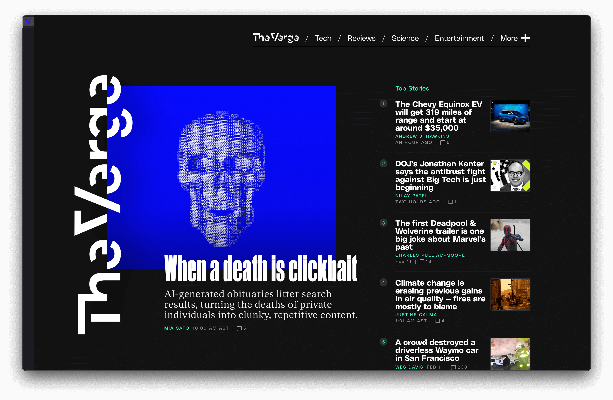
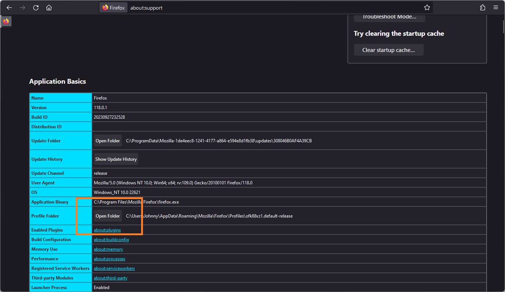
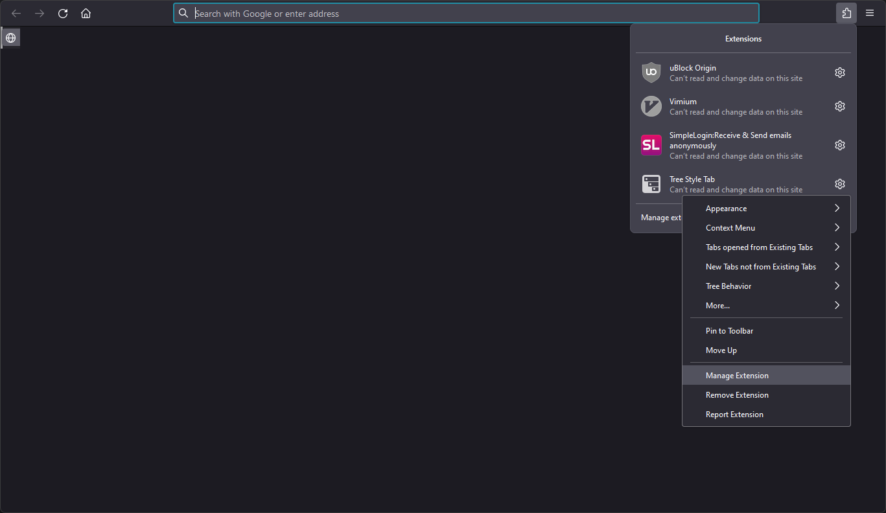
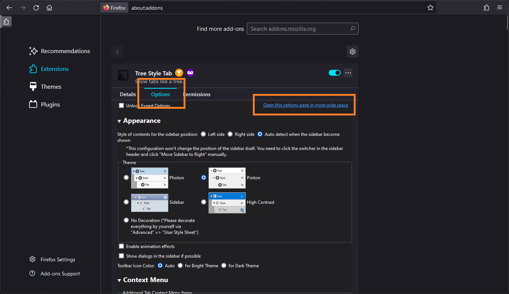
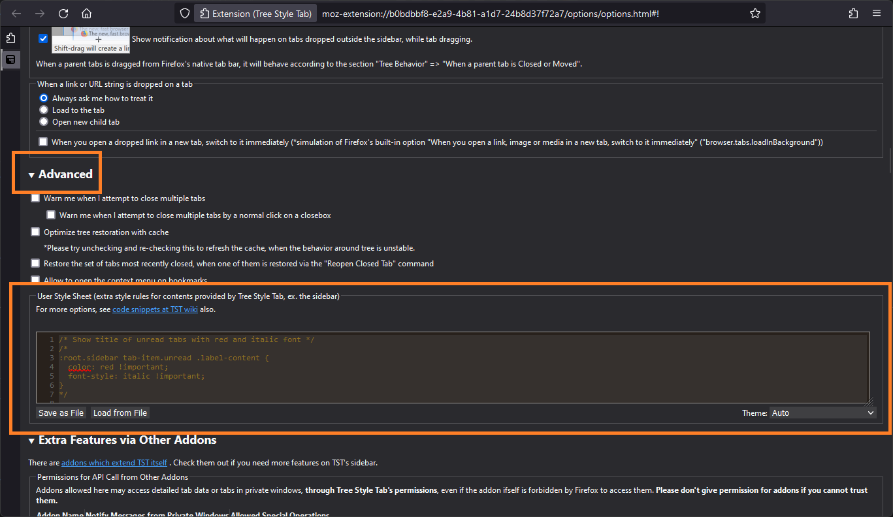
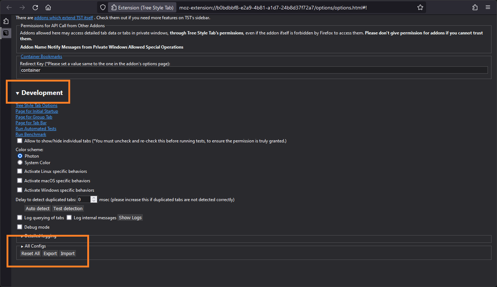

We're going to make Firefox look like this:



The steps are pretty simple. We're going to:

1. Grab the Tree Style Tab Firefox extension.
1. Change Firefox's built-in stylesheet to disable the default horizontal tabs.
1. Edit the styling for config for the Tree Style Tab extension.

## Get the extension

[Tree Style Tab](https://addons.mozilla.org/en-CA/firefox/addon/tree-style-tab/) is an open-source Firefox extension that throws your tabs into a tree-structure on the left or right of the browser window. It's crazy configurable, so we're gonna use it as our vertial tab solution.

1. Open Firefox.
1. Head to the [Tree Style Tab extension page](https://addons.mozilla.org/en-CA/firefox/addon/tree-style-tab/) and click **Add to Firefox**.
1. You can allow the extension to run in Private Windows if you like. We're going to be disabling the topbar horizontal tabs navigation later on, so if you open a Private window and this extension _isn't_ enabled, then you'll find it hard to navigate tabs without using the hot-keys.

## Change the built-in browser styles

Firefox allows you to manually change the way the application looks by enabling a custom config setting and editing some `.CSS` files.

1. In Firefox, go to `about:config`
1. Click **Accept the Risk and Continue**.
1. In the **Search preference name** search bar, enter:

    ```
    toolkit.legacyUserProfileCustomizations.stylesheets
    ```

1. Click the toggle button on the right so the preference says `true`.
1. Still in Firefox, go to `about:support`
1. Find **Profile Folder** section and click **Open Folder**.

    

1. In the folder that opens in your file browser, create a new folder called `chrome`.
1. Inside this new `chrome` folder, create a file called `userChrome.css`. Make sure the file extension is actually `.css` and not `.txt`.
1. Within `userChrome.css` copy and paste the following code:

    ```css
    #TabsToolbar {
        visibility: collapse;
    }

    #titlebar {
        visibility: collapse;
    }

    #sidebar-header {
        visibility: collapse !important;
    }

    .tabbrowser-tab[pinned][selected] ~ .tabbrowser-tab:not([pinned]) {
        transition-duration: 0s !important;
        transition-property:
            width,
            visibility,
            min-width,
            -moz-box-flex !important;
        transition-delay: 3600s !important; /* = 1hr, adjust seconds to increase / decrease visibility */
    }

    .tabbrowser-tab:not([pinned]):not([selected]) {
        visibility: hidden;
        overflow: hidden;
              min-width: 0 !important;
              -moz-box-flex: 0 !important;
    }

    .tabbrowser-tab:not([pinned]) {
        min-width: 0 !important;
        transition-property: width, visibility !important;
        transition-duration: 0.4s !important; /* slide shut */
        transition-delay: 180s !important; /* wait X seconds before hiding inactive tabs | 0 = immediate */
    }

    .tabbrowser-tab[selected]:not([pinned]) {
        min-width: var(--tab-min-width) !important;
    width: var(--tab-min-width) !important;
           transition-duration: 0s !important; /* = immediate */
           transition-delay: 0s !important; /* = immediate */
    }

    #sidebar {
        max-width: none !important;
        min-width: 0px !important;
    }

    #sidebar-box[sidebarcommand="treestyletab_piro_sakura_ne_jp-sidebar-action"]
        + #sidebar-splitter {
        display: none !important;
    }

    #sidebar-box[sidebarcommand="treestyletab_piro_sakura_ne_jp-sidebar-action"]
        #sidebar-header {
        visibility: collapse;
    }

    :root {
        --thin-tab-width: 30px;
        --wide-tab-width: 300px;
    }

    #sidebar-box:not(
        [sidebarcommand="treestyletab_piro_sakura_ne_jp-sidebar-action"]
    ) {
        min-width: var(--wide-tab-width) !important;
        max-width: none !important;
    }

    #sidebar-box[sidebarcommand="treestyletab_piro_sakura_ne_jp-sidebar-action"] {
        overflow: hidden !important;
        position: relative !important;
        transition: all 300ms !important;
        min-width: var(--thin-tab-width) !important;
        max-width: var(--thin-tab-width) !important;
        z-index: 2;
    }

    #sidebar-box[sidebarcommand="treestyletab_piro_sakura_ne_jp-sidebar-action"]:hover,
    #sidebar-box[sidebarcommand="treestyletab_piro_sakura_ne_jp-sidebar-action"]
    #sidebar {
        /*transition-delay: 0s !important;*/
        transition: all 300ms !important;
            min-width: var(--wide-tab-width) !important;
            max-width: var(--wide-tab-width) !important;
            z-index: 1;
    }

    #sidebar-box[sidebarcommand="treestyletab_piro_sakura_ne_jp-sidebar-action"]:hover {
        margin-right: calc(
            (var(--wide-tab-width) - var(--thin-tab-width)) * -1
        ) !important;
    }

    /* ------------------------ */
    /* Autohide menu bar. */
    /* ------------------------ */

    /* Source file https://github.com/MrOtherGuy/firefox-csshacks/tree/master/chrome/autohide_main_toolbar.css made available under Mozilla Public License v. 2.0
       See the above repository for updates as well as full license text. */

    /* This style hides the main toolbar and shows it when the cursor is over the tabs toolbar as well as whenever the focus is inside nav-bar, such as when urlbar is focused. */

    :root {
        --uc-navbar-transform: -40px;
    }
    :root[uidensity="compact"] {
        --uc-navbar-transform: -34px;
    }

    #navigator-toolbox > div {
        display: contents;
    }
    :root[sessionrestored]
    :where(
        #nav-bar,
        #PersonalToolbar,
        #tab-notification-deck,
            .global-notificationbox
    ) {
        transform: translateY(var(--uc-navbar-transform));
    }
    :root:is([customizing], [chromehidden*="toolbar"])
    :where(
        #nav-bar,
        #PersonalToolbar,
        #tab-notification-deck,
        .global-notificationbox
    ) {
        transform: none !important;
        opacity: 1 !important;
    }

#nav-bar:not([customizing]) {
    opacity: 0;
    transition:
        transform 400ms ease 1.8s,
        opacity 400ms ease 1.8s !important;
    position: relative;
        z-index: 2;
    }
    #TabsToolbar {
        position: relative;
        z-index: 3;
    }

    /* Show when toolbox is focused, like when urlbar has received focus */
    #navigator-toolbox:focus-within > .browser-toolbar {
        transform: translateY(0);
        opacity: 1;
        transition-duration: 500ms, 200ms !important;
        transition-delay: 0s !important;
    }
    /* Show when toolbox is hovered */
    #titlebar:hover ~ .browser-toolbar,
    #nav-bar:hover,
    #nav-bar:hover + #PersonalToolbar {
    transform: translateY(0);
    opacity: 1;
        transition-duration: 500ms, 200ms !important;
        transition-delay: 0s !important;
    }

    /* This ruleset is separate, because not having :has support breaks other selectors as well */
    #mainPopupSet:has(> #appMenu-popup:hover)
    ~ #navigator-toolbox
    > .browser-toolbar {
        transition-delay: 33ms !important;
        transform: translateY(0);
        opacity: 1;
    }

    /* Bookmarks toolbar needs so extra rules */
    #PersonalToolbar {
        transition: transform 400ms ease 1.8s !important;
        position: relative;
        z-index: 1;
    }

    /* Move up the content view */
    :root[sessionrestored]:not([inFullscreen], [chromehidden~="toolbar"])
    > body
    > #browser {
        margin-top: var(--uc-navbar-transform);
    }
    ```

1. Save and close `userChrome.css`.

## Edit the extension styling

Lastly, we just need to edit the styling for the Tree Style Tab extension.

1. In Firefox, click the **Extensions** icon and find **Tree Style Tab**. Click the gear icon and then select **Manage extension**:

    

1. Select the **Options** or **Preferences** tab and then click **Open this options page in more wide space**:

    

1. Under **Appreance**, select **Proton**.
1. Open the **Advanced** dropdown and find the **User Style Sheet** section:

    

1. Paste the following code into the codeblock:

    ```css
    :root.sidebar tab-item.unread .label-content {
      color: red !important;
      font-style: italic !important;
    }

    :root.sidebar tab-item.private-browsing tab-label:before {
      content: "🕶";
    }

    #tabbar {
      border: 0;
      scrollbar-width: none;
      overflow: scroll !important;
      margin-top:  0 !important;
    }

    #tabbar .tab {
      transition: 0.1s margin-top, 0.2s 0.1s margin-left, 0.2s 0.1s visibility;
    }

    #tabbar:not(:hover) .tab {
      transition-delay: 0s;
      margin-left: 0;
    }

    #tabbar .tab .twisty {
      transition: 0.2s margin;
    }

    .tab {
      background-color: transparent;
    }
    .tab,
    .tab.pinned {
      height: 2.8em;
    }

    .tab .label {
      margin-left: 1em;
    }

    .tab .closebox {
      margin-left:  0;
    }

    .tab .counter {
      margin-left:  auto;
      display: inline-block !important;
    }

    #tabbar:not(:hover) .tab .twisty {
      visibility: hidden;
      margin-left: -12px;
      transition-delay: 0s;
    }

    .tab:not(:hover) .closebox {
      visibility: hidden;
    }

    .sound-button {
      margin-left: 0;
      display: inline-block;
      visibility: collapse;
    }

    .tab.audible .sound-button {
      visibility: visible;
      margin-left: 0.25em;
    }

    tab-item:not(.subtree-collapsed) .counter {
      visibility: hidden;
    } 

    .newtab-button {
      display: none;
    }

    .tab.active {
      background-color: rgba(255, 255, 255, 0.05) !important;
      box-shadow:  inset 3px 0 0 #ffffff99 !important;
    }

    .tab:hover,
    .tab.active:hover {
      background-color: inherit;
    }

    .tab.active .label {
      font-weight: bold;
      color: #f4f4f4 !important;
    }

    .tab .label,
    .tab.active .label {
      border-bottom:  1px solid transparent;
    }

    .tab:hover .label,
    .tab.active:hover .label {
      border-bottom:  1px dotted;
      min-width:  0 !important;
      flex-shrink:  1 !important;
      flex-grow:  unset !important;
    }

    .tab.discarded {
      background-color: #1d1d1d;
    }

    .tab.discarded .label {
      color: #efefefCC !important;
    }

    .tab.discarded:hover .label {
      color: #efefef !important;
    }

    .tab.sound-playing .favicon::after,
    .tab.muted .favicon::after {
      content: '🔊';
      z-index: var(--favicon-base-z-index);
      position: absolute;
      font-size: 0.5em;
      bottom: -0.35em;
      right: -0.7em;
    }

    .tab.muted .favicon::after {
      content: '🔇';
    }

    .tab.pinned {
      position: relative;
      max-width: none;
      width: auto;
      top: 0 !important;
      left: 0 !important;
    }

    .tab.pinned:not(.active) {
      display: none;
    }

    .tab.pinned .label {
      display: block;
    }

    .tab.pinned .sound-button {
      position: relative;
      transform: none;
    }

    .tab.pinned .twisty {
      display: block;
      min-width: none;
      width: auto;
    }
    ```

1. Expand the **Development** dropdown and find the small **All Configs** section:

    

1. Using Notepad, create a file called `disable-child-tabs.json` and add the following code:

    ```json
    {
      "__ConfigsMigration__userValeusSameToDefaultAreCleared": true,
      "animation": false,
      "autoAttach": false,
      "autoCollapseExpandSubtreeOnAttach": false,
      "autoCollapseExpandSubtreeOnSelect": false,
      "autoCollapseExpandSubtreeOnSelectExceptActiveTabRemove": false,
      "autoDiscardTabForUnexpectedFocus": false,
      "autoGroupNewTabsFromPinned": false,
      "chunkedUserStyleRules0": "LyogU2hvdyB0aXRsZSBvZiB1bnJlYWQgdGFicyB3aXRoIHJlZCBhbmQgaXRhbGljIGZvbnQgKi8KLyoKOnJvb3Quc2lkZWJhciB0YWItaXRlbS51bnJlYWQgLmxhYmVsLWNvbnRlbnQgewogIGNvbG9yOiByZWQgIWltcG9ydGFudDsKICBmb250LXN0eWxlOiBpdGFsaWMgIWltcG9ydGFudDsKfQoqLwoKLyogQWRkIHByaXZhdGUgYnJvd3NpbmcgaW5kaWNhdG9yIHBlciB0YWIgKi8KLyoKOnJvb3Quc2lkZWJhciB0YWItaXRlbS5wcml2YXRlLWJyb3dzaW5nIHRhYi1sYWJlbDpiZWZvcmUgewogIGNvbnRlbnQ6ICLwn5W2IjsKfQoqLwoKCgoKLyogSGlkZSBib3JkZXIgb24gdGFiIGJhciwgZm9yY2UgaXRzIHN0YXRlIHRvICdzY3JvbGwnLCBhZGp1c3QgbWFyZ2luLWxlZnQgZm9yIHdpZHRoIG9mIHNjcm9sbGJhci4gKi8KI3RhYmJhciB7CiAgYm9yZGVyOiAwOwogIHNjcm9sbGJhci13aWR0aDogbm9uZTsKICBvdmVyZmxvdzogc2Nyb2xsICFpbXBvcnRhbnQ7CiAgbWFyZ2luLXRvcDogIDAgIWltcG9ydGFudDsKfQoKLyogSW5jbHVkZSAncmV2ZWFsJyBhbmltYXRpb24gLi4uIHN0YWdlcnMgYnkgbGV2ZWwgKi8KI3RhYmJhciAudGFiIHsKICB0cmFuc2l0aW9uOiAwLjFzIG1hcmdpbi10b3AsIDAuMnMgMC4xcyBtYXJnaW4tbGVmdCwgMC4ycyAwLjFzIHZpc2liaWxpdHk7Cn0KCi8qIGRlbGF5IHRyYW5zaXRpb25zIG9uIG9wZW4gKi8KI3RhYmJhcjpub3QoOmhvdmVyKSAudGFiIHsKICB0cmFuc2l0aW9uLWRlbGF5OiAwczsKICBtYXJnaW4tbGVmdDogMDsKfQoKLyogYW5pbWF0ZSB0d2lzdHkgcmV2ZWFsICovCiN0YWJiYXIgLnRhYiAudHdpc3R5IHsKICB0cmFuc2l0aW9uOiAwLjJzIG1hcmdpbjsKfQoKLyogZ2VuZXJhbCB0YWJzICovCi50YWIgewogIGJhY2tncm91bmQtY29sb3I6IHRyYW5zcGFyZW50Owp9Ci50YWIsCi50YWIucGlubmVkIHsKICBoZWlnaHQ6IDIuOGVtOwp9CgovKiBQdXNoIHRhYiBsYWJlbHMgc2xpZ2h0bHkgdG8gdGhlIHJpZ2h0IHNvIHRoZXkncmUgY29tcGxldGVseSBoaWRkZW4gaW4gY29sbGFwc2VkIHN0YXRlLCBidXQgc3RpbGwgbG9vayBmaW5lIHdoaWxlIGV4cGFuZGVkLiAqLwoudGFiIC5sYWJlbCB7CiAgbWFyZ2luLWxlZnQ6IDFlbTsKfQoKLyogZml4IGNsb3NlYm94ICovCi50YWIgLmNsb3NlYm94IHsKICBtYXJnaW4tbGVmdDogIDA7Cn0KCi50YWIgLmNvdW50ZXIgewogIG1hcmdpbi1sZWZ0OiAgYXV0bzsKICBkaXNwbGF5OiBpbmxpbmUtYmxvY2sgIWltcG9ydGFudDsKfQoKLyogSGlkZSAudHdpc3R5IGFuZCBhZGp1c3QgbWFyZ2lucyBzbyBmYXZpY29ucyBoYXZlIDdweCBvbiBsZWZ0LiAqLwojdGFiYmFyOm5vdCg6aG92ZXIpIC50YWIgLnR3aXN0eSB7CiAgdmlzaWJpbGl0eTogaGlkZGVuOwogIG1hcmdpbi1sZWZ0OiAtMTJweDsKICB0cmFuc2l0aW9uLWRlbGF5OiAwczsKfQoKCi8qIGhpZGUgY2xvc2Vib3ggdW5sZXNzIG5lZWRlZCAqLwoudGFiOm5vdCg6aG92ZXIpIC5jbG9zZWJveCB7CiAgdmlzaWJpbGl0eTogaGlkZGVuOwp9CgovKiBIaWRlIHNvdW5kIHBsYXlpbmcvbXV0ZWQgYnV0dG9uLiAqLwouc291bmQtYnV0dG9uIHsKICBtYXJnaW4tbGVmdDogMDsKICBkaXNwbGF5OiBpbmxpbmUtYmxvY2s7CiAgdmlzaWJpbGl0eTogY29sbGFwc2U7Cn0KCi50YWIuYXVkaWJsZSAuc291bmQtYnV0dG9uIHsKICB2aXNpYmlsaXR5OiB2aXNpYmxlOwogIG1hcmdpbi1sZWZ0OiAwLjI1ZW07Cn0KCi50YWI6bm90KFtkYXRhLWNoaWxkLWlkc10pIC5jb3VudGVyIHsKICAvKiB2aXNpYmlsaXR5OiBoaWRkZW47ICovCn0KCnRhYi1pdGVtOm5vdCguc3VidHJlZS1jb2xsYXBzZWQpIC5jb3VudGVyIHsKICB2aXNpYmlsaXR5OiBoaWRkZW47Cn0gCgovKiBIaWRlICduZXcgdGFiJyBidXR0b24uICovCi5uZXd0YWItYnV0dG9uIHsKICBkaXNwbGF5OiBub25lOwp9CgovKiBhY3RpdmUgdGFiICovCi50YWIuYWN0aXZlIHsKICBiYWNrZ3JvdW5kLWNvbG9yOiByZ2JhKDI1NSwgMjU1LCAyNTUsIDAuMDUpICFpbXBvcnRhbnQ7CiAgYm94LXNoYWRvdzogIGluc2V0IDNweCAwIDAgI2ZmZmZmZjk5ICFpbXBvcnRhbnQ7Cn0KLnRhYjpob3ZlciwKLnRhYi5hY3RpdmU6aG92ZXIgewogIGJhY2tncm91bmQtY29sb3I6IGluaGVyaXQ7Cn0KLnRhYi5hY3RpdmUgLmxhYmVsIHsKICBmb250LXdlaWdodDogYm9sZDsKICBjb2xvcjogI2Y0ZjRmNCAhaW1wb3J0YW50Owp9Ci50YWIgLmxhYmVsLAoudGFiLmFjdGl2ZSAubGFiZWwgewogIGJvcmRlci1ib3R0b206ICAxcHggc29saWQgdHJhbnNwYXJlbnQ7Cn0KLnRhYjpob3ZlciAubGFiZWwsCi50YWIuYWN0aXZlOmhvdmVyIC5sYWJlbCB7CiAgYm9yZGVyLWJvdHRvbTogIDFweCBkb3R0ZWQ7CiAgbWluLXdpZHRoOiAgMCAhaW1wb3J0YW50OwogIGZsZXgtc2hyaW5rOiAgMSAhaW1wb3J0YW50OwogIGZsZXgtZ3JvdzogIHVuc2V0ICFpbXBvcnRhbnQ7Cn0KCi8qIHBlbmRpbmcgLyB1bmxvYWRlZCB0YWJzICovCi50YWIuZGlzY2FyZGVkIHsKICBiYWNrZ3JvdW5kLWNvbG9yOiAjMWQxZDFkOwp9Ci50YWIuZGlzY2FyZGVkIC5sYWJlbCB7CiAgY29sb3I6ICNlZmVmZWZDQyAhaW1wb3J0YW50Owp9Ci50YWIuZGlzY2FyZGVkOmhvdmVyIC5sYWJlbCB7CiAgY29sb3I6ICNlZmVmZWYgIWltcG9ydGFudDsKfQoKLyogQWRqdXN0IHN0eWxlIGZvciB0YWIgdGhhdCBoYXMgc291bmQgcGxheWluZy4gKi8KLnRhYi5zb3VuZC1wbGF5aW5nIC5mYXZpY29uOjphZnRlciwKLnRhYi5tdXRlZCAuZmF2aWNvbjo6YWZ0ZXIgewogIGNvbnRlbnQ6ICfwn5SKJzsKICB6LWluZGV4OiB2YXIoLS1mYXZpY29uLWJhc2Utei1pbmRleCk7CiAgcG9zaXRpb246IGFic29sdXRlOwogIGZvbnQtc2l6ZTogMC41ZW07CiAgYm90dG9tOiAtMC4zNWVtOwogIHJpZ2h0OiAtMC43ZW07Cn0KCi8qIEFkanVzdCBzdHlsZSBmb3IgdGFiIHRoYXQgaXMgbXV0ZWQuICovCi50YWIubXV0ZWQgLmZhdmljb246OmFmdGVyIHsKICBjb250ZW50OiAn8J+Uhyc7Cn0KCi8qIFBpbm5lZCB0YWJzOiAqLwovKiBIaWRlIGFsbCBub24tYWN0aXZlIHBpbm5lZCB0YWJzICh0aGVzZSBhcmUgaW5jbHVkZWQgaW4gdG9wLWJhciBpbnN0ZWFkKSAqLwoudGFiLnBpbm5lZCB7CiAgcG9zaXRpb246IHJlbGF0aXZlOwogIG1heC13aWR0aDogbm9uZTsKICB3aWR0aDogYXV0bzsKICB0b3A6IDAgIWltcG9ydGFudDsKICBsZWZ0OiAwICFpbXBvcnRhbnQ7Cn0KLnRhYi5waW5uZWQ6bm90KC5hY3RpdmUpIHsKICBkaXNwbGF5OiBub25lOwp9Ci50YWIucGlubmVkIC5sYWJlbCB7CiAgZGlzcGxheTogYmxvY2s7Cn0KLnRhYi5waW5uZWQgLnNvdW5kLWJ1dHRvbiB7CiAgcG9zaXRpb246IHJlbGF0aXZlOwogIHRyYW5zZm9ybTogbm9uZTsKfQoudGFiLnBpbm5lZCAudHdpc3R5IHsKICBkaXNwbGF5OiBibG9jazsKICBtaW4td2lkdGg6IG5vbmU7CiAgd2lkdGg6IGF1dG87Cn0=",
      "configsVersion": 28,
      "groupTabTemporaryStateForChildrenOfPinned": 0,
      "insertNewTabFromPinnedTabAt": 1,
      "maxTreeLevel": 0,
      "notifiedFeaturesVersion": 9,
      "optionsExpandedSections": [
        "section-advanced",
        "section-appearance",
        "section-contextMenu",
        "section-newTabWithOwner",
        "section-debug",
        "section-addons",
        "section-drag",
        "section-treeBehavior",
        "section-newTab"
      ],
      "supportTabsMultiselect": false,
      "syncDevices": {
        "device-1695298964619-51455": {
          "id": "device-1695298964619-51455",
          "name": "Firefox on Windows",
          "icon": "device-desktop",
          "timestamp": 1696430252614
        }
      },
      "syncParentTabAndOpenerTab": false,
      "undoMultipleTabsClose": false,
      "useCachedTree": false,
      "userStyleRules": "",
      "userStyleRulesFieldHeight": "120px",
      "warnOnCloseTabs": false,
      "warnOnCloseTabsByClosebox": false,
      "warnOnCloseTabsWithListing": false
    } 
    ```

1. Back in Firefox, click **Import** and select the file you just created.
1. Close and reopen Firefox.

## Done

That should be everything! You now have vertial tabs to the left of your screen, with no child or indented tabs!
