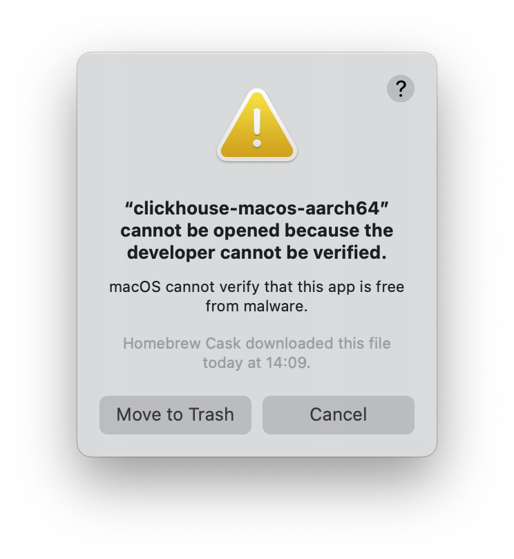
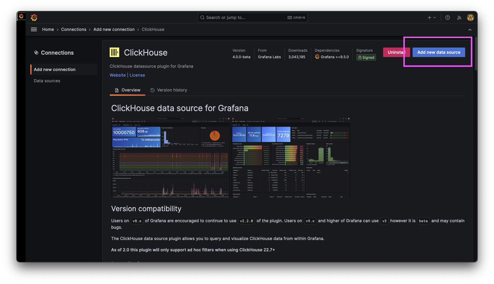
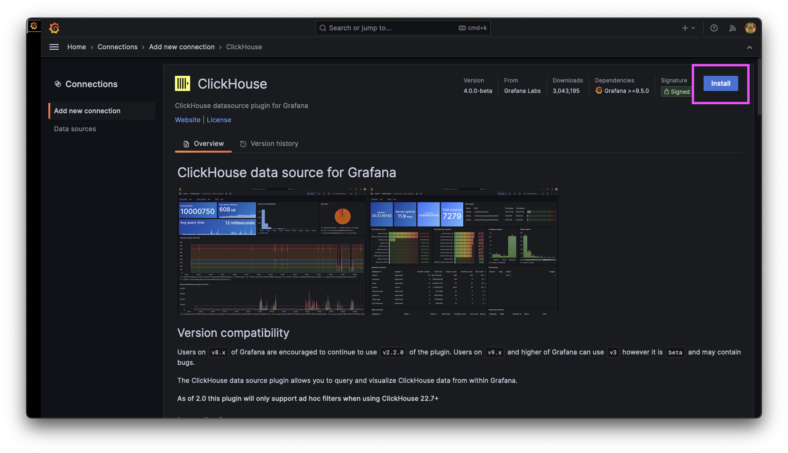
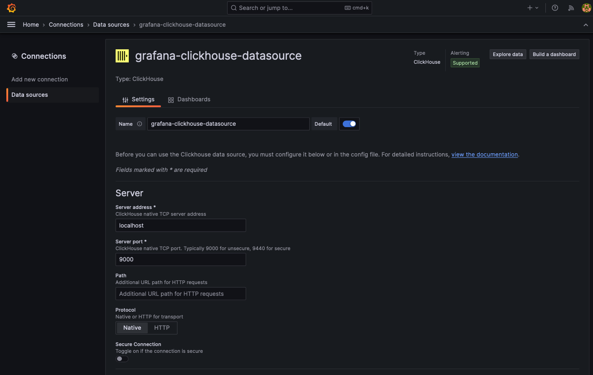
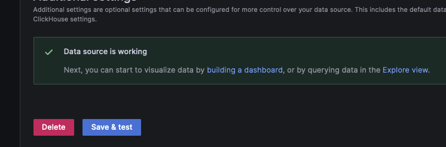
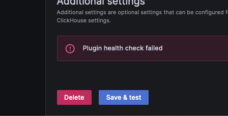

# Do stuff with ClickHouse

By the end of this tutorial you'll know how to actually do useful stuff with ClickHouse, not just how to install it or run a bunch of random queries. I'm running MacOS, so take that into account if you're on a different operating system.

## Install ClickHouse

Use Brew to install ClickHouse:

```shell
brew install --cask clickhouse
```

Annoyingly, installing the app this was throws an error because Apple haven't verified anything:



To get around this verification error, remove the app from MacOS' quarintine bin. First find out where Brew installed the `clickhouse` executable:

```shell
which clickhouse
```

This should output something like:

```shell
/opt/homebrew/bin/clickhouse
```

Remove `clickhouse` from the quarantine bin by running `xattr -d com.apple.quarantine` following by the path from the previous command:

```shell
xattr -d com.apple.quarantine /opt/homebrew/bin/clickhouse
```

You should now be able to run the `clickhouse` executable:

```shell
clickhouse
```

This should output something like:

```
Use one of the following commands:
clickhouse local [args]
clickhouse client [args]
clickhouse benchmark [args]
...
```

Start a local ClickHouse service:

```shell
clickhouse server
```

This should output something like:

```response
Processing configuration file 'config.xml'.
There is no file 'config.xml', will use embedded config.
2024.01.02 14:49:48.097550 [ 418559 ] {} <Information> Application: Starting ClickHouse 23.12.1.1368 (revision: 54481, git hash: a2faa65b080a587026c86844f3a20c74d23a86f8, build id: <unknown>), PID 14258
...
```

## Grab a dataset

To do anything interesting with ClickHouse, you first need some data. We're going to cover how to grab data from your own sources like a website later on in this tutorail. But for now, let's use one of the example datasets from clickhouse.com/docs. Specifcally, we're going to download and use an obfuscated version of analytics from the ClickHouse.com website.

Download the dataset from within your terminal like a good little hacker. You may need to install `ux` first:

```shell
if ! type "xz" > /dev/null; then brew install xz; fi
wget https://datasets.clickhouse.com/hits/tsv/hits_v1.tsv.xz && unxz hits_v1.tsv.xz
```

The file is ~800MB, so may take a few minutes to download and uncompress.

Create a database to house everything, along with a table specifically for the analytics data. Sorry, the command is really big because the table schema is really big:

```shell
clickhouse client --query "CREATE DATABASE IF NOT EXISTS datasets"
clickhouse client --query "CREATE TABLE datasets.hits_v1 (
   WatchID UInt64, JavaEnable UInt8, Title String,
   GoodEvent Int16, EventTime DateTime, EventDate Date,
   CounterID UInt32, ClientIP UInt32, ClientIP6 FixedString(16),
   RegionID UInt32, UserID UInt64, CounterClass Int8,
   OS UInt8, UserAgent UInt8, URL String, Referer String,
   URLDomain String, RefererDomain String, Refresh UInt8,
   IsRobot UInt8, RefererCategories Array(UInt16),
   URLCategories Array(UInt16), URLRegions Array(UInt32),
   RefererRegions Array(UInt32), ResolutionWidth UInt16,
   ResolutionHeight UInt16, ResolutionDepth UInt8,
   FlashMajor UInt8, FlashMinor UInt8, FlashMinor2 String,
   NetMajor UInt8, NetMinor UInt8, UserAgentMajor UInt16,
   UserAgentMinor FixedString(2), CookieEnable UInt8,
   JavascriptEnable UInt8, IsMobile UInt8, MobilePhone UInt8,
   MobilePhoneModel String, Params String, IPNetworkID UInt32,
   TraficSourceID Int8, SearchEngineID UInt16, SearchPhrase String,
   AdvEngineID UInt8, IsArtifical UInt8, WindowClientWidth UInt16,
   WindowClientHeight UInt16, ClientTimeZone Int16,
   ClientEventTime DateTime, SilverlightVersion1 UInt8,
   SilverlightVersion2 UInt8, SilverlightVersion3 UInt32,
   SilverlightVersion4 UInt16, PageCharset String,
   CodeVersion UInt32, IsLink UInt8, IsDownload UInt8,
   IsNotBounce UInt8, FUniqID UInt64, HID UInt32,
   IsOldCounter UInt8, IsEvent UInt8, IsParameter UInt8,
   DontCountHits UInt8, WithHash UInt8, HitColor FixedString(1),
   UTCEventTime DateTime, Age UInt8, Sex UInt8, Income UInt8,
   Interests UInt16, Robotness UInt8, GeneralInterests Array(UInt16),
   RemoteIP UInt32, RemoteIP6 FixedString(16), WindowName Int32,
   OpenerName Int32, HistoryLength Int16, BrowserLanguage FixedString(2),
   BrowserCountry FixedString(2), SocialNetwork String,
   SocialAction String, HTTPError UInt16, SendTiming Int32,
   DNSTiming Int32, ConnectTiming Int32, ResponseStartTiming Int32,
   ResponseEndTiming Int32, FetchTiming Int32, RedirectTiming Int32,
   DOMInteractiveTiming Int32, DOMContentLoadedTiming Int32,
   DOMCompleteTiming Int32, LoadEventStartTiming Int32,
   LoadEventEndTiming Int32, NSToDOMContentLoadedTiming Int32,
   FirstPaintTiming Int32, RedirectCount Int8,
   SocialSourceNetworkID UInt8, SocialSourcePage String,
   ParamPrice Int64, ParamOrderID String, ParamCurrency FixedString(3),
   ParamCurrencyID UInt16, GoalsReached Array(UInt32),
   OpenstatServiceName String, OpenstatCampaignID String,
   OpenstatAdID String, OpenstatSourceID String, UTMSource String,
   UTMMedium String, UTMCampaign String, UTMContent String,
   UTMTerm String, FromTag String, HasGCLID UInt8,
   RefererHash UInt64, URLHash UInt64, CLID UInt32, YCLID UInt64,
   ShareService String, ShareURL String, ShareTitle String,
   ParsedParams Nested(
           Key1 String,
           Key2 String,
           Key3 String,
           Key4 String,
           Key5 String,
           ValueDouble Float64
           ),
   IslandID FixedString(16),
   RequestNum UInt32,
   RequestTry UInt8
)
ENGINE = MergeTree()
PARTITION BY toYYYYMM(EventDate)
ORDER BY (CounterID, EventDate, intHash32(UserID))
SAMPLE BY intHash32(UserID)
SETTINGS index_granularity = 8192"
```

Finally, import all the data from the ClickHouse.com analytics dataset:

```shell
cat hits_v1.tsv | clickhouse client --query "INSERT INTO datasets.hits_v1 FORMAT TSV" --max_insert_block_size=100000
```

In the next section we'll query the data directly through the `clickhouse client` command.

## Query the data

So we've got some data in a ClickHouse database. Let's throw some queries at it to see what happens.

### Open the SQL console

Enter the SQL console by opening a new terminal window and using the `clickhouse client` command. You'll know you're in the SQL console when you see your computer's name followed by `:)`:

```plaintext
ClickHouse client version 23.12.1.1368 (official build).
Connecting to localhost:9000 as user default.
Connected to ClickHouse server version 23.12.1.

Warnings:
 * Maximum number of threads is lower than 30000. There could be problems with handling a lot of simultaneous queries.

meepo.lan :)
```

### Run some queries

To do something fairly simple like counting how many distinct `RegionID`s there are, run something like:

```sql
SELECT COUNT(DISTINCT RegionID) FROM datasets.hits_v1;
```

```response
SELECT COUNTDistinct(RegionID)
FROM datasets.hits_v1

Query id: d7f931ac-c24c-483e-9560-69c81a6fecc1

┌─uniqExact(RegionID)─┐
│                4727 │
└─────────────────────┘

1 row in set. Elapsed: 0.019 sec. Processed 8.87 million rows, 35.50 MB (460.65 million rows/s., 1.84 GB/s.)
Peak memory usage: 654.37 KiB.
```

You can run slighly more complex queries such as showing the last 10 results based on `ClientEventTime` while limiting the response to 30 characters of the `URL`, `ClientEventTime`, `EventTime`, and `SearchPhrase` fields:

```sql
SELECT LEFT(URL, 30) AS URL, LEFT(Title, 30) AS Title, ClientEventTime, EventTime, LEFT(SearchPhrase, 30) AS SearchPhrase 
FROM datasets.hits_v1 
ORDER BY ClientEventTime DESC 
LIMIT 100;
```

```reponse
SELECT
    LEFT(URL, 30) AS URL,
    LEFT(Title, 30) AS Title,
    ClientEventTime,
    EventTime,
    LEFT(SearchPhrase, 30) AS SearchPhrase
FROM datasets.hits_v1
ORDER BY ClientEventTime DESC
LIMIT 10

Query id: 19bd6d97-8d7d-4d4c-bc88-29ef99b19977

┌─URL────────────────────────────┬─Title─────────────┬─────ClientEventTime─┬───────────EventTime─┬─SearchPhrase───────┐
│ http://public/?hash=8vIx7SAgLk │                   │ 2036-04-10 10:06:27 │ 2014-03-20 04:38:53 │                    │
│ http://public/?hash=8vIx7SAgLk │ Такси в Башки пи  │ 2036-04-10 10:06:17 │ 2014-03-20 04:38:27 │                    │
│ http://tv.yandex.php?p=11&depa │                   │ 2036-04-10 09:18:05 │ 2014-03-20 06:02:26 │                    │
│ http://tv.yandex.php?p=11&depa │ Оформа сентуки в  │ 2036-04-10 09:17:55 │ 2014-03-20 06:02:11 │ великолько стол    │
│ http://fanfiscategory/2-k_kvar │                   │ 2035-03-21 21:34:23 │ 2014-03-21 09:17:38 │                    │
│ http://fanfiscategory/2-k_kvar │ мультикорина Ша   │ 2035-03-21 21:34:13 │ 2014-03-21 09:17:23 │ недвижимость paypa │
│ http://carperevo-a             │ Скачать и дня - с │ 2035-03-21 16:37:58 │ 2014-03-21 09:28:02 │                    │
│ http://public_search           │                   │ 2035-03-21 14:43:59 │ 2014-03-21 02:25:05 │                    │
│ http://public_search           │ HD Tube 5*        │ 2035-03-21 14:43:48 │ 2014-03-21 02:24:54 │                    │
│ http://tvforsite.nakhome_s=&r1 │                   │ 2035-03-21 14:37:54 │ 2014-03-21 21:29:01 │                    │
└────────────────────────────────┴───────────────────┴─────────────────────┴─────────────────────┴────────────────────┘

10 rows in set. Elapsed: 0.199 sec. Processed 8.87 million rows, 1.72 GB (44.61 million rows/s., 8.64 GB/s.)
Peak memory usage: 69.38 MiB.
```

### Query responses

Notice that ClickHouse returns a few pieces of information:

1. A copy of your the query that you submitted in an easy-to-read format:

    ```sql
    SELECT COUNTDistinct(RegionID)
    FROM datasets.hits_v1
    ```

1. A query ID. This is useful if you want to reference or repeat a command from earlier:

    ```plaintext
    Query id: d7f931ac-c24c-483e-9560-69c81a6fecc1
    ```

1. The result of your query, formatted in an easy-to-read table:

    ```plaintext
    ┌─uniqExact(RegionID)─┐
    │                4727 │
    └─────────────────────┘
    ```

1. Some performance-based metrics such as the read-speed and peak memory usage:

    ```plaintext
    1 row in set. Elapsed: 0.019 sec. Processed 8.87 million rows, 35.50 MB (460.65 million rows/s., 1.84 GB/s.)
    Peak memory usage: 654.37 KiB.
    ```

Running queries in the SQL console is all well and good, but what if you want to display this data in a nice GUI?

## Display data in Grafana

Grafana is a fairly straight-forward solution to help you visiualize your data. We're going to install a local version of Grafana to showcase our analytics data.

### Install Grafana locally

Follow these steps to install Grafana locally on your MacOS system:

```shell
brew update
brew install Grafana
brew services start grafana
```

Go to [`localhost:3000/`](http://localhost:3000) and log into Grafana using `admin` for both the username and password. You'll be asked to set a new password immediatly after logging in. You can set a new password, or just skip this step since you likely won't be using this instance ever again.

### Add your ClickHouse data

1. Once you're in Grafana you can add your ClickHouse database by clicking the menu icon and going to **Connections** > **Add new connection**:

    

1. Search for **ClickHouse** and select the yellow ClickHouse icon.
1. Click **Install**:

    

1. Finally, click **Add new data source**:

    

Grafana will now ask you for a bunch of details about your ClickHouse server. Since we're running things locally they shouldn't be too hard to find.

#### Server address and port



1. To get your server address, run `clickhouse client` in a terminal window. Your address and port will be listed at the top:

    ```shell
    clickhouse client

    ClickHouse client version 23.12.1.1368 (official build).
    Connecting to localhost:9000 as user default.
    ...
    ```

    In this case, our server address is `localhost` and the port is `9000`.

1. Leave the **Path** field empty.
1. Set **Protocol** to **Native**.
1. Leave **Secure connection** disabled.

#### TSL/SSL settings

We don't need to change anything in this section. Leave everything as the default settings.


Just incase you changed something, these settings should be:

- **Skip TLS Verify**: `false`
- **TLS Client Auth**: `false`
- **With CA Cert**: `false`

#### Credentials

Usually this section is important, but since we're connecting to a local ClickHouse server we can leave these fields blank:

- **Username**: ``
- **Password**: ``

#### Additional settings

There aren't any settings in this section that we need to change. You can safely ignore it.

#### Save and move one

Now that we've got all our settings sorted, click **Save & test**. Grafana will test the connection; if it's succesfful then it will save our settings:



If the check fails, Grafana will output a warning:



### View data in Grafana

## Create your own dataset

## Troubleshooting

### Can't start the server.

You may encounter an error similar to the following:

```shell
<Warning> Application: Listen [::1]:8123 failed: Poco::Exception. Code: 1000, e.code() = 48, Net Exception: Address already in use:
```

There error is usually caused by a previous `clickhouse server` command not exiting correctly. To solve this issue and start a local ClickHouse server again you need to find the process identifier (PID) of the `clickhouse server` process, and `kill` it.

The `<Warning>` message above references port `8123`. We can use this to find the PID of the `clickhouse` command. The port that your `clickhouse` process is using may be different to `8123`:

```shell
sudo lsof -i :8123
```

This will output something like:

```shell
COMMAND     PID   USER   FD   TYPE             DEVICE SIZE/OFF NODE NAME
clickhous 14258 johnny    6u  IPv6 0x7c089d1b313f0acf      0t0  TCP localhost:8123 (LISTEN)
clickhous 14258 johnny   13u  IPv4 0x7c089d24ca219fa7      0t0  TCP localhost:8123 (LISTEN)
```

This shows that the PID for `clickhouse` is `14258`. The PID of your `clickhouse` command will likely be different. We can use this to kill the `clickhouse server` process:

```shell
kill -9 14258
```

The `kill` command does not output anything on success.

You should now be able to run `clickhouse server` normally.


