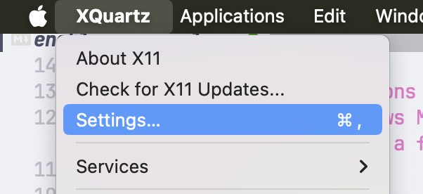
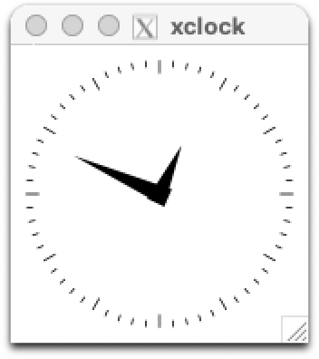

We'll split this up into sections based on the machine you're running things on. Let's start with your MacOS device:

## MacOS device

1. Install Xquarts:

  ```shell
  brew install --cask xquartz
  ```

1. Restart your device. Kinda annoying I know, but it's necessary.
1. Once you've booted back up, open XQuarts.
1. In the top menubar, select **XQuarts** -> **Settings**.

  

1. Select the security tab and check **Allow connections from network clients**.
1. Restart XQuartz.
1. Grab the IP address of your VM. Replace `hackbox` with whatever you called your VM:

  ```shell
  multipass list | grep hackbox | awk '{print $3}'
  ```

  ```output
  192.168.64.8
  ```

  You can also just run `multipass list` to view all your VM details:

  ```shell
  multipass list
  ```

  ```output
  Name                    State             IPv4             Image
  hackbox                 Running           192.168.64.8     Ubuntu 24.04 LTS
  ```

1. Allow connections to the X server:

  ```shell
  xhost +192.168.64.8
  ```

1. Get your device's IP address on the network:

  ```shell
  ifconfig en0 | grep inet | awk '$1=="inet" {print $2}'
  ```

  ```shell
  192.168.228.115
  ```

  Make a note of this IP address; we're gonna use it in a few seconds.

## Virtual machine

Now we're gonna move into the VM running in Multipass:

1. Update the package list and install `x11-apps`:

  ```shell
  sudo apt update
  sudo apt install -y x11-apps
  ```

1. Set the `DISPLAY` variable to point to your MacOS device's X server, appending `:0` to the end of the IP address:

  ```shell
  export DISPLAY=192.168.228.115:0
  ```

1. Try and run `xclock`:

  

1. That's it!

## For future session

1. On your Mac:

  ```shell
  # Start XQuartz:
  open -a XQuartz

  # Get the IP of your VM running in Multipass:
  VMIPADDRESS=(multipass list | grep hackbox | awk '{print $3}')

  # Allow connections
  xhost +$VMIPADDRESS

  # Get your Mac's current IP (it might change after every restart):
  ifconfig en0 | grep inet | awk '$1=="inet" {print $2}'
  ```

1. In your VM:

  ```shell
  export DISPLAY=<YOUR_MAC_IP>:0
  ```
