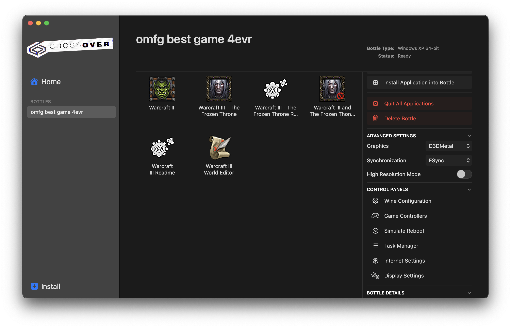
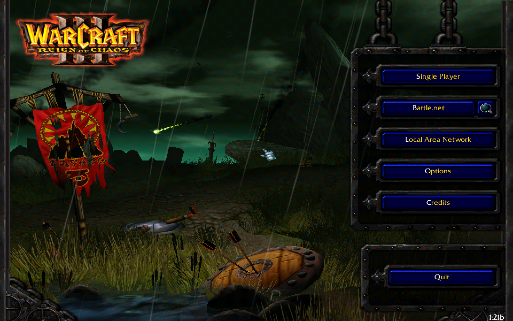

When I started writing this guide it include a lot of steps like:

- Download Warcraft 3.
- Create a new bottle in CrossOver.
- Make a bunch of weird tweaks to the VM so that things just about work properly.

But then I realized that I can just export the CrossOver bottle and share that with you lot.

## Prerequisites

You literally just need [Crossover](https://www.codeweavers.com/crossover) installed.

## Steps

1. Download the public [Warcraft 3 Crossover archive package](https://drive.proton.me/urls/4C0ZPDWJRM#2ruRsZtAOUv4). Don't be scared of the Proton Drive website -- encryption is good for you.
1. Open Crossover.
1. In the menubar select **File** and then **Open**.
1. Select the **wc3.cxarchive** package you just downloaded.
1. Give the bottle a nice name like _omfg best game 4evr_ and click **Create**.
1. Double-click either the _Reign of Chaos_ or _The Frozen Throne_ icons, depending on which emotions you want to feel:

  

1. Your screen might go black a couple of times, but it _should_ eventually open to the classic Warcraft 3 welcome screen:
  
  

1. You're done.

## Some things to note

1. Clicking on **Options** will cause your game to crash. I dunno why, but I'm trying to figure it out.
1. The text looks weird in places. Again, dunno why.
1. Battle.net will not work. Blame Blizzard.
1. I've zero idea if the World Editor works. Give it a go.
